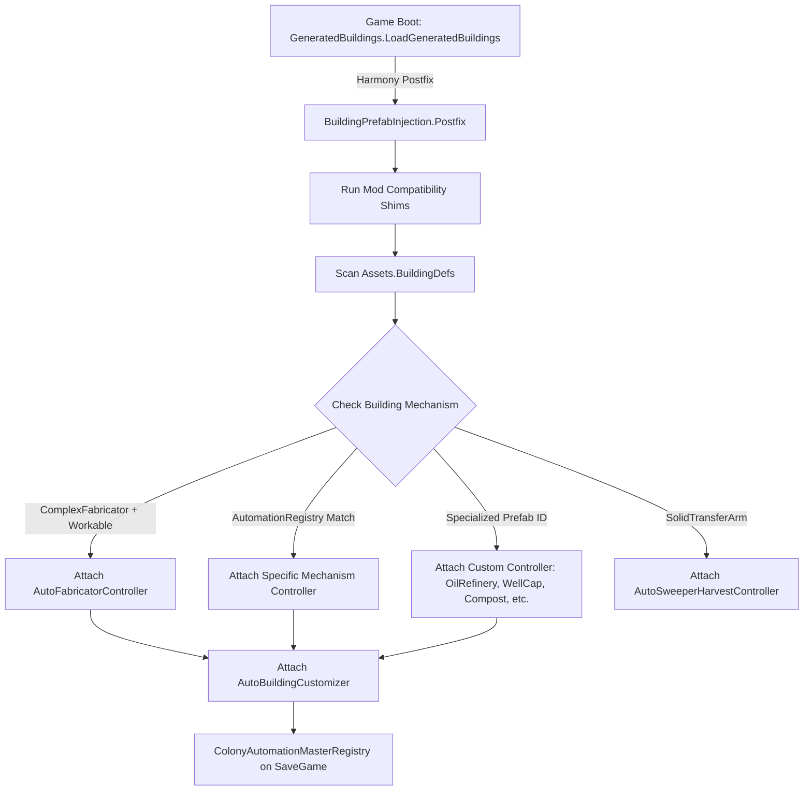
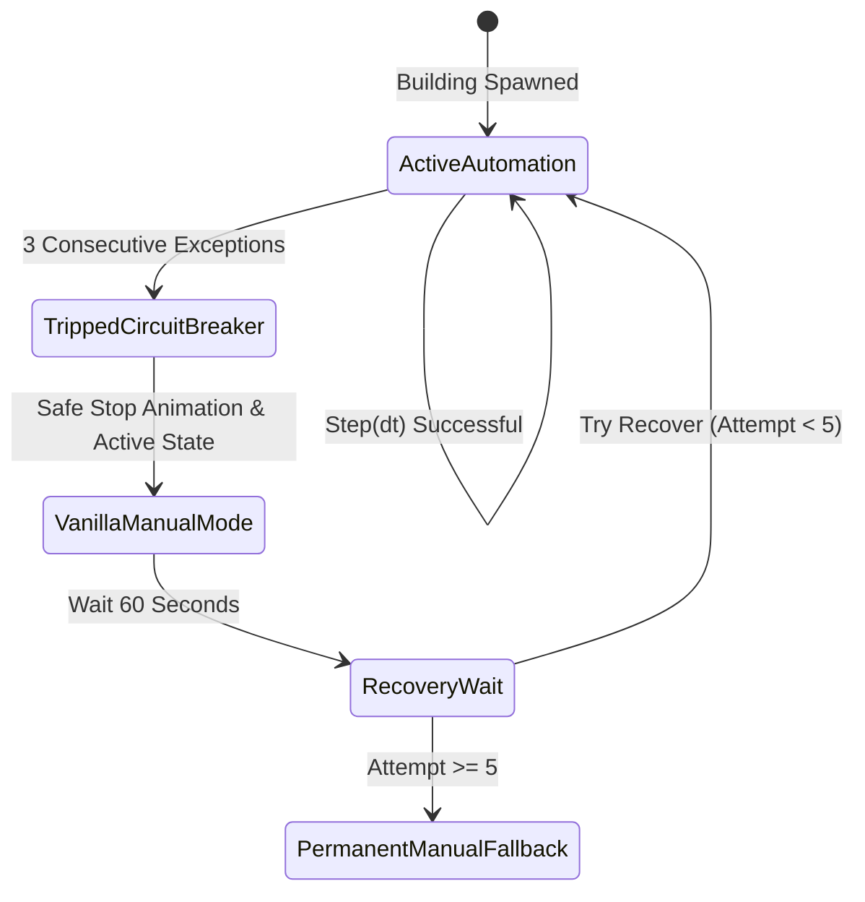

# Architecture & Core Engineering Systems

This document details the architectural foundation, design patterns, and engineering systems that power **Automatic Industry (Auto Machine Rebuilt)**.

---

## 🏛️ 1. Core Engineering Principles

Automatic Industry is engineered from the ground up to guarantee maximum stability, mod compatibility, and game performance:

1. **Passive Component Injection over Brittle Transpilers**:
   - Rather than rewriting vanilla bytecode using Harmony IL transpilers (which frequently break with game updates or conflict with other mods), ~70% of the mod's logic is implemented as clean, standalone Unity `KMonoBehaviour` components attached directly to completed building prefabs.
2. **Zero Save-Data Footprint (100% Save Safe)**:
   - The mod serializes **no custom types, no custom MonoBehaviours, and no custom entity data** into the `.sav` file.
   - Per-building toggle preferences are stored in the vanilla `KPrefabID` tags / clean colony-wide key-value dictionaries.
   - Players can safely add, update, or remove the mod at any time without corrupting save files or leaving orphaned data blocks.
3. **Duplicant Priority ("Duplicant Always Wins")**:
   - If a player commands a Duplicant to manually operate an automated station, or if a Duplicant begins working before automation engages, the automation controller immediately steps aside, yields control, and resumes only after the Duplicant finishes.
4. **Safe Exception Containment (`SafeInvoke` & Circuit Breakers)**:
   - All runtime evaluations are protected by circuit breakers. Transient game errors (e.g. critter despawning mid-groom, pipe bursting, or rocket launch) degrade gracefully to manual mode without crashing the game thread.

---

## 🔌 2. Prefab Injection Pipeline

### Why Postfix on `LoadGeneratedBuildings`?
Vanilla *Oxygen Not Included* loads buildings through individual `IBuildingConfig` implementations (e.g., `CookingStationConfig.cs`). 

* **The Trap**: Patching `IBuildingConfig.CreateBuildingDef` or `DoPostConfigureComplete` directly forces the static constructor of the config class to execute during early mod loading. Several vanilla configs invoke `Db.Get()` inside their static constructors. If `Db.Get()` runs before the database is initialized, Unity throws a fatal `TypeInitializationException`. The cached exception breaks `BuildingConfigManager.RegisterBuilding` for all subsequent buildings and crashes ONI at the main menu.
* **The Solution**: Automatic Industry hooks into `GeneratedBuildings.LoadGeneratedBuildings` as a `[HarmonyPostfix]`. At this stage:
  1. All vanilla and modded building defs are fully constructed.
  2. The `Database` is completely initialized.
  3. DLC filters are already applied (missing DLC content simply doesn't exist in `Assets.BuildingDefs`, preventing missing asset errors).

### Injection Pipeline Flow



### Constant Value Reflection Index
To map config classes to registry options without running static constructors, `BuildingPrefabInjection.BuildDriverKeyIndex()` reads the `ID` string literal via:
```csharp
FieldInfo idField = configType.GetField("ID", BindingFlags.Public | BindingFlags.NonPublic | BindingFlags.Static);
string value = idField.GetRawConstantValue() as string;
```
`GetRawConstantValue()` retrieves the string directly from the assembly's compiled metadata table without triggering class initialization!

---

## 🎛️ 3. Per-Building UserMenu Customizer (`AutoBuildingCustomizer`)

Every automated building receives the `AutoBuildingCustomizer` component, enabling players to configure automation individually for that specific building instance.

### Dual Toggle Modes
1. **Instant Toggle (Cheat/Debug Mode)**:
   - When enabled in mod options, clicking the UserMenu button instantly flips the building's automation state on/off.
2. **Duplicant Wrench Errand (Survival Immersion)**:
   - When instant toggle is disabled, clicking the button queues an **"Adjust Automation Setting"** chore (`AutomationToggleWorkable`).
   - A Duplicant with the Building / Operating skill visits the machine with a wrench, plays the tweaking animation, and applies the setting upon errand completion.

### Priority Resolution Chain
When checking whether an automated building should run, the controller queries:
```csharp
AutoMachineOptions.IsEnabledFor(gameObject, optionKey)
```
The decision follows a strict hierarchy:
1. **Per-Building Instance Override**: If the player explicitly toggled this building instance (recorded in `AutoBuildingCustomizer`), that preference takes absolute precedence.
2. **Colony Master Registry**: If set via colony-wide batch tool, uses the colony registry.
3. **Global Mod Options**: Falls back to the global toggle in the mod options menu.

---

## 🚫 4. Chore Suppression System

When a building is operating automatically, Duplicants should not run across the map to perform unnecessary "Operate" errands. However, they **must still perform delivery, supply, and emptying chores**.

### Zero-Allocation Operate Chore Cancellation
`AutoWorkControllerBase.Update()` invokes:
```csharp
ChoreSuppression.CancelOperateChores(gameObject);
```
- **Targeted Filtering**:
  - Cancels chores belonging to `Db.Get().ChoreTypes.Cook`, `Db.Get().ChoreTypes.Fabricate`, `Db.Get().ChoreTypes.Operate`, and `RanchStation.Instance`.
  - **Preserves** logistics errands: `Db.Get().ChoreTypes.FabricateFetch`, `Db.Get().ChoreTypes.MachineFetch`, `Db.Get().ChoreTypes.EmptyStorage`.
- **Zero-Allocation**: Uses static arrays and caches to avoid generating garbage collection (GC) pressure in Unity's 200ms tick loop.

### Station Precondition Suppression (`StationChoreSuppressionPatches`)
For complex stations (`PowerControlStation`, `FarmStation`):
- Many mods try to suppress errands by returning `null` from `CreateChore()`. In vanilla ONI, returning `null` causes downstream callers in `TinkerStation.SetupChore()` to crash with a `NullReferenceException`.
- Automatic Industry instead patches chore preconditions:
  ```csharp
  chore.AddPrecondition(ChorePreconditions.instance.IsNotAutomated, null);
  ```
  Returning `false` for the precondition cleanly instructs the Duplicant chore solver that the errand is currently unavailable without destabilizing the state machine.

---

## ⚡ 5. Circuit Breaker (`SafeInvoke` & Controller Lifecycle)

To protect the game simulation from edge cases, every automation controller inherits from `AutoWorkControllerBase`:

### Circuit Breaker Parameters:
- **`EvaluationInterval = 0.2f`**: Evaluates 5 times per second rather than every frame (`Update`), reducing CPU overhead by >90%.
- **`FailureLimit = 3`**: If 3 consecutive exceptions occur while executing a building's `Step(dt)`, the circuit breaker trips (`brokenOut = true`).
- **`RecoveryDelaySeconds = 60f`**: The building stays in vanilla manual mode for 60 seconds before testing recovery.
- **`RecoveryLimit = 5`**: If the building fails recovery 5 times in a row, automation permanently disengages for that instance, leaving it in normal vanilla manual operation.



---

## 🧩 6. Mod Compatibility Shims

Automatic Industry includes dedicated compatibility layers for popular ONI mods:

| Mod | Compatibility Challenge | Automatic Industry Solution |
| :--- | :--- | :--- |
| **Customize Buildings** | Changes storage sizes, element converter rates, and refinery internal logic. | `CustomizeBuildingsCompatibility.Apply()` verifies refinery ratios dynamically and synchronizes converter outputs without overwriting custom capacities. |
| **No Manual Delivery** | Disables Duplicant manual delivery to automated machines. | `NoManualDeliveryCompatibility.cs` falls back cleanly to `MinionGroupProber` to verify reachability without throwing missing prober exceptions. |
| **EmptyStorage** | Third-party mod adding manual drop buttons to storage. | `VanillaEmptyPaths.cs` checks and marks dropped items, restoring interaction tables and preventing double-dropping or item deletion. |
| **Adjustable Transfer Arm & Zoned Arm** | Expands or offsets the sweep and reach area of Auto-Sweepers. | `AutoSweeperHarvestController.cs` reads the dynamic grid boundaries rather than hardcoded 4-cell radii, allowing harvesting anywhere the custom arm can reach. |
| **FastTrack** | Heavily optimizes game loops and skips redundant GameObject component lookups. | Controllers cache references during `Prepare()` and avoid reflective searches during high-frequency simulation ticks. |
| **ONI Together (Multiplayer)** | Synchronizes game state over network packets. | All state changes rely on standard game events (`Trigger`, `Operational.SetActive`), ensuring deterministic state propagation across clients. |
