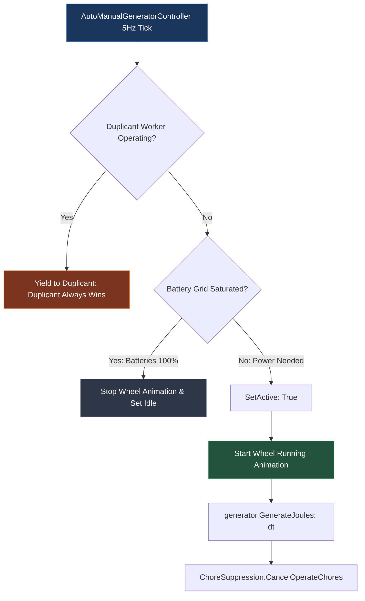
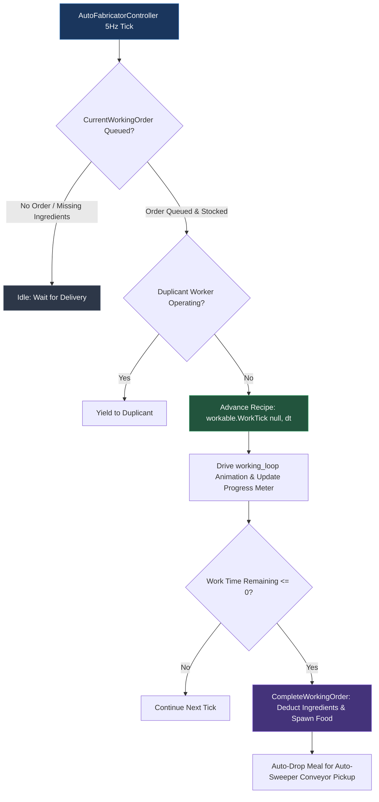
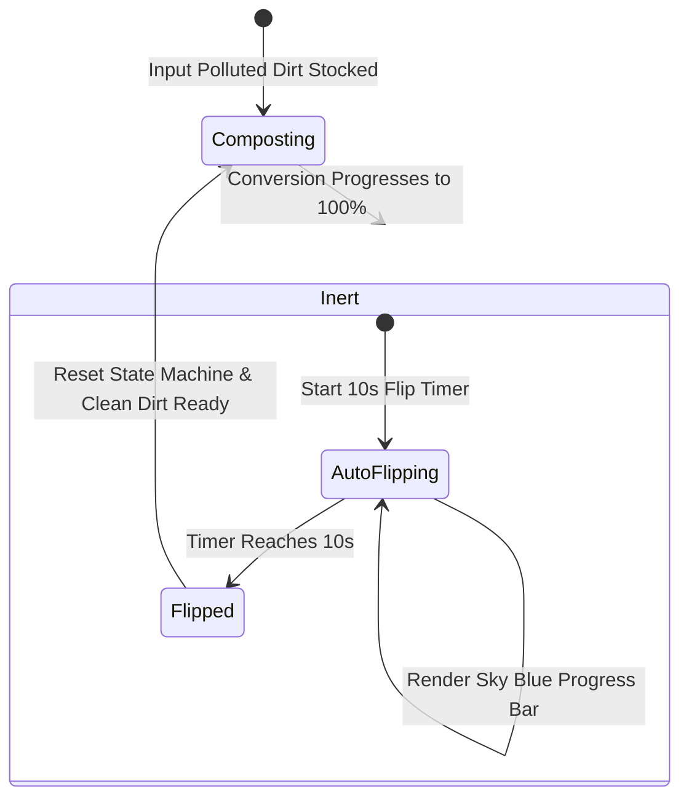
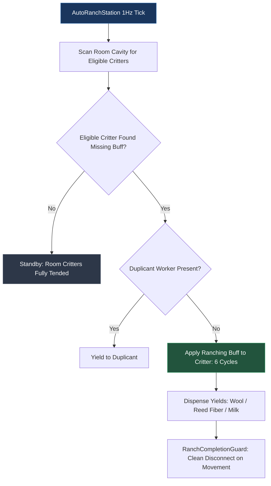
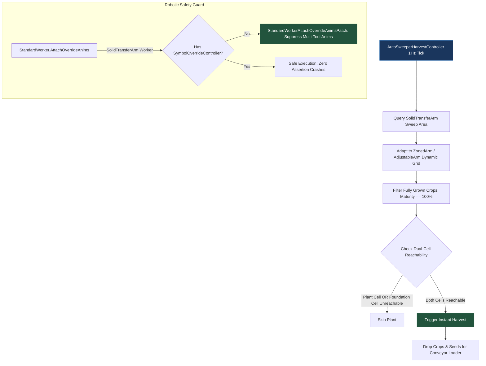

# Automated Buildings Code Logic & Function Reference

This document is the definitive technical reference for every automated building in **Automatic Industry (Auto Machine Rebuilt)**. It details the underlying C# controller classes, simulation cadences (`ISim200ms`, `ISim1000ms`), state machine hooks, chore suppressions, progress meters, and operational flows.

---

## 📊 Building Automation Matrix at a Glance

| Category | Building | Prefab ID | Controller Class | Cadence | Automation Behavior |
| :--- | :--- | :--- | :--- | :---: | :--- |
| **⚡ Power** | Manual Generator | `ManualGenerator` | `AutoManualGeneratorController` | 5Hz | Runs wheel automatically when battery grid demands power. |
| | Manual Radbolt Gen | `ManualHighEnergyParticleSpawner` | `AutoFabricatorController` | 5Hz | Ticks radbolt fabrication recipe and emits particles. |
| **🍲 Food** | Microbe Musher | `MicrobeMusher` | `AutoFabricatorController` | 5Hz | Cooks queued recipes without duplicants. |
| | Electric Grill | `CookingStation` | `AutoFabricatorController` | 5Hz | Cooks queued meal orders continuously. |
| | Gas Range | `GourmetCookingStation` | `AutoFabricatorController` | 5Hz | Cooks gourmet meals continuously. |
| | Deep Fryer | `Deepfryer` | `AutoFabricatorController` | 5Hz | Prepares fried foods continuously. |
| | Spice Grinder | `SpiceGrinder` | `AutoSpiceGrinderController` | 5Hz | 100 kg headroom; converts fetches to `FabricateFetch`. |
| | Sushi Bar | `SushiBar` | `AutoFabricatorController` | 5Hz | Prepares raw seafood and sushi dishes. |
| | Food Dehydrator | `FoodDehydrator` | `AutoStorageReleaseController` | 1Hz | Dehydrates rations and auto-ejects packaged rations. |
| | Food Smoker | `Smoker` | `AutoFoodSmoker` | 1Hz | Smokes rations and auto-drops finished products. |
| **🚰 Plumbing** | Liquid Valve | `LiquidValve` | `AutoValveController` | 5Hz | Instantly applies slider flow rate changes without wrench errands. |
| | Gas Valve | `GasValve` | `AutoValveController` | 5Hz | Instantly applies slider flow rate changes without wrench errands. |
| | Bottle Filler | `LiquidBottler` | `AutoBottler` | 1Hz | Unlocks stored bottles for direct Auto-Sweeper pickup. |
| | Canister Filler | `GasBottler` | `AutoBottler` | 1Hz | Unlocks stored gas canisters for direct Auto-Sweeper pickup. |
| **🏭 Refinement** | Oil Refinery | `OilRefinery` | `AutoOilRefinery` | 5Hz | Refines crude oil; supports 50% vanilla and 100% legacy rates. |
| | Desalinator | `Desalinator` | `HardThresholdRelease` | 1Hz | Auto-ejects accumulated salt upon reaching ~945 kg. |
| | Compost | `Compost` | `CompostAutomationComponent` | 5Hz | Automated pitchfork flipping with dual progress bars. |
| | Rock Crusher | `Crusher` | `AutoFabricatorController` | 5Hz | Crushes ore, table salt, sand, and lime automatically. |
| | Metal Refinery | `MetalRefinery` | `AutoFabricatorController` | 5Hz | Smelts refined metals and alloys continuously. |
| | Glass Forge | `GlassForge` | `AutoFabricatorController` | 5Hz | Melts sand into molten glass continuously. |
| | Plywood Press | `WoodTileFabricator` | `AutoFabricatorController` | 5Hz | Presses wood into structural plywood. |
| | Sludge Press | `SludgePress` | `AutoFabricatorController` | 5Hz | Compresses mud and sludge into water and dirt. |
| | Diamond Press | `DiamondPress` | `AutoFabricatorController` | 5Hz | Compresses refined carbon into diamonds. |
| | Bleach Hopper/Gleaner | `MilkFatSeparator` | `AutoStorageReleaseController` | 1Hz | Separates brackwax and drops solid output automatically. |
| | Ice Liquefier | `IceKettle` | `VanillaEmptyPaths` | 1Hz | Melts ice and auto-ejects bottled water when tank is full. |
| **🐾 Ranching** | Grooming Station | `RanchStation` | `AutoRanchStation` | 1Hz | Tends critters automatically; applies 6-cycle Groomed buff. |
| | Shearing Station | `ShearingStation` | `AutoRanchStation` | 1Hz | Shears eligible critters; drops wool/fiber to station floor. |
| | Milking Station | `MilkingStation` | `AutoRanchStation` | 1Hz | Milks brackene critters; dispenses milk without duplicant. |
| | Aquatic Variants | `UnderwaterRanchStation` | `AutoRanchStation` | 1Hz | Automated aquatic critter grooming and shearing. |
| **🌾 Farming** | Farm Station | `FarmStation` | `AutoTinkerStationController` | 5Hz | Fabricates Micronutrient Fertilizer; suppresses operate chores. |
| **🧪 Science** | Research Center | `ResearchCenter` | `AutoResearchController` | 5Hz | Consumes dirt; generates Novice Research points. |
| | Supercomputer | `AdvancedResearchCenter` | `AutoResearchController` | 5Hz | Dual-fetch enabled; consumes water and generates tech points. |
| | Material Study Terminal | `NuclearResearchCenter` | `AutoNuclearResearchCenterController` | 5Hz | Consumes radbolts; generates Nuclear Research points. |
| | Botanical Analyzer | `GeneticAnalysisStation` | `AutoGeneticAnalysisStationController` | 5Hz | Analyzes mutant seeds and unlocks genetic traits. |
| | Telescopes | `Telescope` / `ClusterTelescope` | `AutoTelescopeController` | 5Hz | Conducts celestial and deep space astronomy scanning. |
| **🛠️ Utilities** | Oil Well Cap | `OilWellCap` | `AutoOilWellCap` | 1Hz | Automatically vents backpressure at configurable threshold. |
| | Ice-E Fan | `IceCooledFan` | `AutoIceCooledFanController` | 5Hz | Cools ambient air automatically while ice is stocked. |
| | Wood Heater | `WoodHeater` | `AutoWorkControllerBase` | 5Hz | Maintains space heating continuously. |
| **🚀 Rocketry** | Mission Control | `MissionControl` / `Cluster` | `AutoMissionControlController` | 1Hz | Broadcasts orbital speed guidance to inbound/orbiting rockets. |
| **🤖 Robotics** | Biobot Builder | `MorbRoverMaker` | `AutoMorbRoverMaker` | 1Hz | Assembles Morb Rovers automatically from steel and biomass. |
| | Auto-Sweeper Harvest | `SolidTransferArm` | `AutoSweeperHarvestController` | 1Hz | Universal crop harvest engine with dual-cell reach check. |

---

## 1. ⚡ Power Category

### Manual Generator (Hamster Wheel)
- **Prefab**: `ManualGenerator`
- **Controller Class**: `AutoManualGeneratorController` (inherits `AutoWorkControllerBase`)
- **Key Logic**:
  1. Detects grid state via `generator.JoulesToGenerate`. If batteries connected to the wire circuit are below their threshold, automation activates.
  2. Directly calls `generator.GenerateJoules(dt)` at 5Hz (`ISim200ms`).
  3. Cancels manual Duplicant run errands via `ChoreSuppression.CancelOperateChores(gameObject)`, preventing Duplicants from running across the base when automation is handling the load.

### Manual Radbolt Generator
- **Prefab**: `ManualHighEnergyParticleSpawner`
- **Controller Class**: `AutoFabricatorController`
- **Key Logic**: Operated via the unified `ComplexFabricator` pipeline. Advances radbolt generation work cycles, triggers particle beam emissions upon completion, and updates the building's radbolt meter.

---

## 2. 🍲 Food & Cooking Category

### Cooking Stations (Electric Grill, Gas Range, Microbe Musher, Deep Fryer, Sushi Bar)
- **Controller Class**: `AutoFabricatorController`
- **Key Logic**:
  1. **Chore Detachment**: Flips `ComplexFabricator.duplicantOperated = false`. This suppresses publishing `WorkChore` to the Duplicant brain, while leaving raw material delivery errands (`FabricateFetch`) completely open for Auto-Sweepers and Duplicants.
  2. **Work Progression**: Calls `workable.WorkTick(null, dt)`, driving the cooking meter and animation loops.
  3. **Order Completion**: Spawns finished food dishes and triggers `CompleteWorkingOrder()`.

### Spice Grinder
- **Prefab**: `SpiceGrinder`
- **Controller Class**: `AutoSpiceGrinderController` & `SpiceGrinderPatches`
- **Key Features**:
  1. **100 kg Headroom Expansion**: In vanilla, `seedStorage.capacityKg = totalKg * 10f` (only 31 kg for Preserving Spice). Delivering 30 kg of salt left <1.0 kg capacity, which deadlocked delivery because seed items have a minimum 1.0 kg discrete mass. The mod expands capacity to `Mathf.Max(totalKg * 20f, 100f)`, guaranteeing salt and seeds can always be delivered in parallel.
  2. **Auto-Sweeper Delivery**: Converts spice delivery errands to `Db.Get().ChoreTypes.FabricateFetch`, enabling Auto-Sweepers (`SolidTransferArm`) to load seeds and spices.
  3. **Self-Healing Fetches**: `OnFetchEndedSafe` cleans dead chore handles, eliminating the vanilla bug where cancelled spice deliveries permanently froze the grinder.

### Food Dehydrator & Food Smoker
- **Controllers**: `AutoStorageReleaseController` & `AutoFoodSmoker`
- **Key Logic**: In vanilla, dehydrated ration packets and smoked foods remain trapped inside the machine until a Duplicant arrives to manually empty it. The mod inspects the output storage every second and executes `storage.DropAll()`, immediately freeing the machine for continuous automated processing.

---

## 3. 🚰 Plumbing & Ventilation Category

### Liquid Valve & Gas Valve
- **Prefabs**: `LiquidValve`, `GasValve`
- **Controller Class**: `AutoValveController`
- **Key Logic**:
  1. Compares `Valve.desiredFlow` with `Valve.currentFlow` at 5Hz.
  2. When the player adjusts the flow slider, `AutoValveController` sets `ValveBase.CurrentFlow = Valve.desiredFlow` immediately in memory and cancels pending Duplicant wrench errands (`valve.CancelPendingChore()`).
  3. Real-time visual needle updates give instantaneous feedback.

### Bottle Filler & Canister Filler (Bottler Automation)
- **Prefabs**: `LiquidBottler`, `GasBottler`, `LiquidPumpingStation`
- **Controller Class**: `AutoBottler` (Cadence: `ISim1000ms`)
- **Key Logic**:
  1. **Direct Auto-Sweeper Extraction**: Sets `storage.allowItemRemoval = true` and re-targets `pickupable.targetWorkable = pickupable` on stored bottles.
  2. **Zero Spillage**: Auto-Sweepers can reach directly into the filler to deposit bottles onto Conveyor Loaders without dumping liquids or gases onto the floor.
  3. **Visual Meter**: Optional real-time progress bar (0% -> 100%) tracking accumulated mass against storage capacity.

---

## 4. 🏭 Refinement & Manufacturing Category

### Oil Refinery
- **Prefab**: `OilRefinery`
- **Controller Class**: `AutoOilRefinery`
- **Key Logic**:
  1. Evaluates state machine: activates when Crude Oil input > 0 kg, power is supplied, and ambient gas pressure < 5.0 kg.
  2. **Dual Efficiency Modes**:
     - **Vanilla 50% Rate**: `10 kg/s Crude Oil` → `5 kg/s Petroleum` + `90 g/s Natural Gas`.
     - **Full 100% Rate**: `10 kg/s Crude Oil` → `10 kg/s Petroleum` + `180 g/s Natural Gas`.

### Desalinator
- **Prefab**: `Desalinator`
- **Components**: `HardThresholdRelease` & `VanillaEmptyPaths`
- **Key Logic**:
  1. Prevents spilling saltwater: rather than a generic `DropAll()`, it monitors accumulated salt mass.
  2. When salt mass reaches threshold (>= 90% capacity or 945 kg), it invokes `DesalinatorWorkableEmpty.CompleteWork(null)`, cleanly dropping only the solid Salt and lifting it out of foundation tiles.

### Compost
- **Prefab**: `Compost`
- **Controller Class**: `CompostAutomationComponent`
- **Key Logic**:
  1. **Primary Progress Bar**: Displays decomposition progress from polluted dirt to clean dirt (0% -> 100%).
  2. **Automated Pitchfork Flipping**: When the compost becomes `inert`, starts an automated 10-second flip cycle with a **Sky Blue progress bar**. Displays countdown timer in the building status item.

---

## 5. 🐾 Ranching & Stations Category

### Ranching Stations (Grooming, Shearing, Milking)
- **Prefabs**: `RanchStation`, `ShearingStation`, `MilkingStation`, plus Underwater DLC variants
- **Controller Class**: `AutoRanchStation` & `RanchCompletionGuard`
- **Key Logic**:
  1. Evaluates room cavity boundaries for critters lacking the ranching effect (`Groomed`, `Sheared`, `Milked`).
  2. Tends 1 eligible critter per interval, applying the 6-cycle buff directly to the critter's `Effects` component and dispensing yields to the floor.
  3. `RanchCompletionGuard` prevents memory leaks if a critter moves, burrows, or despawns mid-operation.

### Farm Station & Power Control Station
- **Prefabs**: `FarmStation`, `PowerControlStation`
- **Controller Class**: `AutoTinkerStationController`
- **Key Logic**:
  1. Checks colony demand: Farm Station checks whether greenhouse plants require Micronutrient Fertilizer; Power Station checks whether generators require Microchips (configurable via "Ignore Demand" settings).
  2. Consumes refined metal or phosphorite from storage, constructs tools at `transform.GetPosition() + Vector3.up`, and suppresses manual Duplicant chores cleanly via precondition patching.

### Mission Control Station
- **Prefabs**: `MissionControl`, `MissionControlCluster`
- **Controller Class**: `AutoMissionControlController`
- **Key Logic**: Completely avoids vanilla `MissionControlWorkable` (which crashes without an active Duplicant). Instead, directly queries `smi.sm.WorkableRocketsAreInRange` and applies the 10-minute rocket speed boost cleanly.

---

## 6. 🧪 Research, Science & Astronomy Category

### Research Center & Supercomputer
- **Prefabs**: `ResearchCenter`, `AdvancedResearchCenter`, `CosmicResearchCenter`, `DLC1CosmicResearchCenter`
- **Controller Class**: `AutoResearchController`
- **Key Features**:
  1. **Dual Delivery Injection (Supercomputer)**: Vanilla water delivery uses `ResearchFetch` (Duplicant only). The mod attaches a secondary `ManualDeliveryKG` with `MachineFetch`, allowing Auto-Sweepers to deliver bottled water directly from reservoirs!
  2. **Point Generation**: Queries `Research.Instance.GetActiveResearch()`, consumes dirt/water/data banks, adds research points, and displays floating research FX popups.

### Telescopes (Planetary & Enclosed)
- **Prefabs**: `Telescope`, `ClusterTelescope`, `ClusterTelescopeEnclosed`
- **Controller Class**: `AutoTelescopeController`
- **Key Logic**: Advances celestial scanning automatically as long as line-of-sight to space is clear and oxygen/power requirements are fulfilled. Correctly displays the enclosed observatory icon in Spaced Out!

---

## 7. 🛠️ Utilities Category

### Oil Well Cap
- **Prefab**: `OilWellCap`
- **Controller Class**: `AutoOilWellCap` (Cadence: `ISim1000ms`)
- **Key Logic**:
  1. Monitors backpressure via `smi.GetPressurePercent()`.
  2. When pressure exceeds the configured threshold slider, engages `smi.sm.working.Set(true, smi)` to vent natural gas down to 0%.
  3. Renders a Backpressure meter at the building base and displays a status countdown timer.

### Ice-E Fan
- **Prefab**: `IceCooledFan`
- **Controller Class**: `AutoIceCooledFanController`
- **Key Logic**: Cools ambient air automatically using stored ice. Supports continuous cooling or honors vanilla 5°C freeze shutoff.

---

## 8. 🌾 Universal Auto-Sweeper Crop Harvesting

### Universal Plant Harvesting Engine
- **Target**: `SolidTransferArm`
- **Controller Class**: `AutoSweeperHarvestController`
- **Key Features**:
  1. **Dual-Cell Reachability**: Validates reachability for both the crop cell and the planter box / hydroponic tile foundation cell, preventing sweeping deadlocks.
  2. **Dynamic Range Integration**: Automatically reads custom reach boundaries from *Zoned Solid Transfer Arm* and *Adjustable Transfer Arm*.
  3. **Robotic Worker Safety Shield**: `StandardWorkerAttachOverrideAnimsPatch` suppresses attaching Duplicant multi-tool animations to robotic arms, completely eliminating the engine assert crash:  
     `Assert failed: Anim overrides containing additional symbols require a symbol override controller`.
