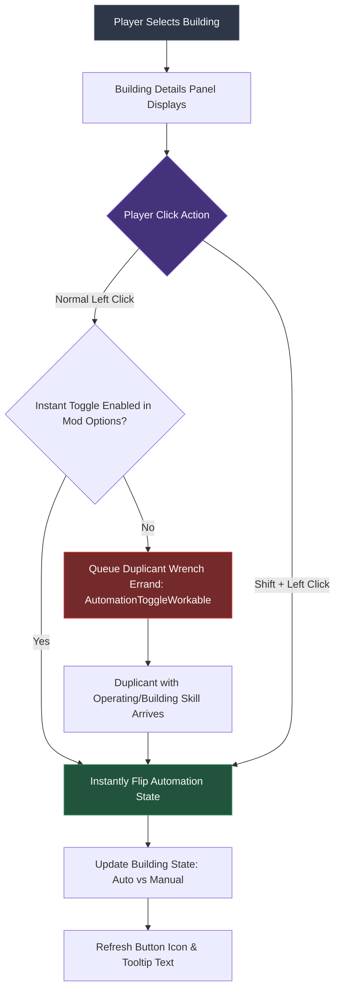
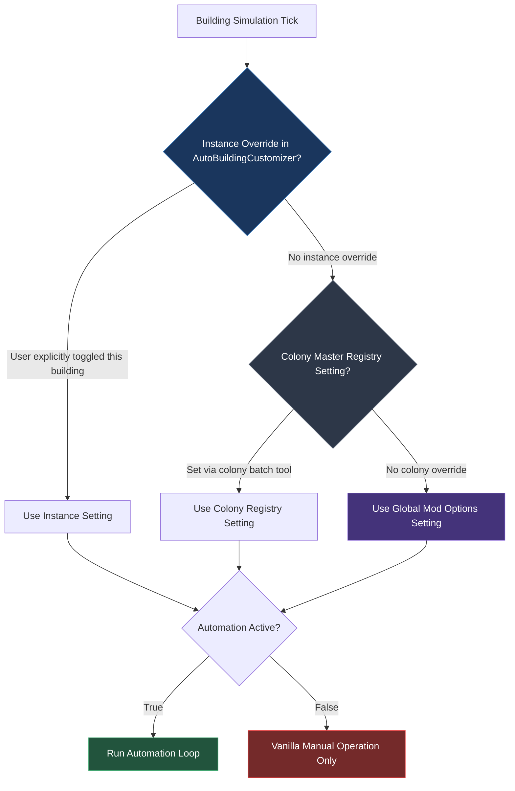

# Building Configuration & Controls Guide

Automatic Industry provides a multi-tiered control system allowing players to configure automation globally, by category, or per individual building instance.

---

## 🖥️ 1. Dual-Pane Building Configuration Editor

Introduced in **v2.5.0**, the Building Configuration Editor provides a centralized, full-screen management interface accessible directly from the Mod Options menu or Pause Screen (via ModMenu).

### Visual Interface Layout

```
┌────────────────────────────────────────────────────────────────────────────────────────────────────────┐
│  AUTOMATIC INDUSTRY - BUILDING CONFIGURATION                                                   [ X ]   │
├───────────────────────────────┬────────────────────────────────────────────────────────────────────────┤
│  🔍 [ Search buildings...   ] │  ⚡ POWER (2 Buildings)                                                │
│                               ├────────────────────────────────────────────────────────────────────────┤
│  CATEGORIES                   │  ┌─────────────────────────────────────────────────────────┐          │
│                               │  │ [HAMSTER WHEEL ICON]  Manual Generator                  │          │
│  ⭐ All Buildings    [42/42]   │  │ Automatically runs when connected battery grid needs    │ [ ON ]   │
│  ⚡ Power            [ 2/ 2]   │  │ power. Yields immediately to manual duplicant run.      │          │
│  🍲 Food & Cooking   [ 8/ 8]   │  └─────────────────────────────────────────────────────────┘          │
│  🚰 Plumbing/Vent    [ 3/ 3]   │  ┌─────────────────────────────────────────────────────────┐          │
│  🏭 Refinement       [11/11]   │  │ [RADBOLT ICON]  Manual Radbolt Generator                │          │
│  🐾 Ranching         [ 6/ 6]   │  │ Generates radbolts automatically without duplicant.     │ [ ON ]   │
│  🌾 Farming          [ 1/ 1]   │  └─────────────────────────────────────────────────────────┘          │
│  🧪 Science          [ 5/ 5]   │                                                                        │
│  🛠️ Utilities        [ 4/ 4]   │  🍲 FOOD & COOKING (8 Buildings)                                       │
│  🚀 Rocketry         [ 2/ 2]   │  ┌─────────────────────────────────────────────────────────┐          │
│                               │  │ [GRILL ICON]  Electric Grill                            │          │
│                               │  │ Cooks queued recipes automatically. Auto-drops meals.    │ [ ON ]   │
│                               │  └─────────────────────────────────────────────────────────┘          │
├───────────────────────────────┴────────────────────────────────────────────────────────────────────────┤
│  [ 🔄 Toggle All Visible ]                      [ 💾 Save Configuration ]              [ 🚪 Exit ]     │
└────────────────────────────────────────────────────────────────────────────────────────────────────────┘
```

### Key Editor Features

| Control Element | Behavior & Action | Shortcut / Detail |
| :--- | :--- | :--- |
| **Search Bar** | Filters building cards in real time across building names, internal IDs, and descriptions. | Text input with instant UI debounce. |
| **Category List** | Switches the displayed building group. Displays live counters (`Active / Total`). | Click to switch categories. |
| **Building Card Toggle** | Toggles automation for that specific building type. Visual state updates instantly between `ON` (Green) and `OFF` (Gray). | Click to toggle state. |
| **Batch Toggle Button** | Flips all currently displayed buildings (matching active category and search filter) between all enabled and all disabled. | Single-click batch operation. |
| **Save Button** | Explicitly commits all configuration changes to disk and displays a green confirmation indicator. | Writes directly to mod settings file. |
| **Immediate Auto-Save** | Every toggle action automatically commits changes to memory and disk in the background upon closing or switching screens. | Prevents configuration loss on sudden exit. |

> [!TIP]
> **Standalone Features in Mod Options**:  
> System-wide automation mechanics that do not map to standard building prefabs—specifically **Auto-Sweeper Crop Harvesting** (`SolidTransferArm`) and **Geyser Study Automation** (`GeyserStudy`)—are configured directly within the main **Mod Options (PLib)** dialog rather than the Building Editor.

---

## 🎛️ 2. In-Game Building Details Automation Button

Every automated building placed in your colony features an interactive automation button located directly on its building selection panel (bottom-right of the screen).



### Click Mechanics & Shortcuts

```
┌──────────────────────────────────────────────────────────────┐
│  [ ⚙️ AUTOMATIC ]   (Normal Click)                            │
│  ──────────────────────────────────────────────────────────  │
│  Tooltip Description:                                        │
│  "Current mode: Automatic. Duplicants will not manually     │
│   operate this building while automated."                    │
│                                                              │
│  ⚡ [Shift + Left Click]: Instantly toggle automation state   │
│     without queueing a Duplicant adjustment errand.          │
│                                                              │
│  [Mod: Automatic Industry]                                   │
└──────────────────────────────────────────────────────────────┘
```

1. **Shift + Left Click (Instant Override)**:
   - **Bypasses Duplicant errands completely**.
   - Instantly toggles the building between `Automatic` and `Manual` mode without waiting for a Duplicant to arrive with a wrench.
   - Ideal for emergency overrides or testing automation setups.
2. **Normal Left Click (Survival Immersion)**:
   - If *Instant Toggle* is enabled in Mod Options: toggles immediately.
   - If *Instant Toggle* is disabled: queues an **Adjust Automation Setting** errand (`AutomationToggleWorkable`). A Duplicant with the Building or Operating skill will visit the machine and tune it with a wrench.

---

## 📐 3. Configuration Priority Resolution

When an automated building evaluates whether it is allowed to run, it resolves settings through a strict three-tier hierarchy:



1. **Building Instance Level (`AutoBuildingCustomizer`)**:
   - Explicit changes made via the in-game building details button override all higher-level settings for that specific machine.
2. **Colony Master Registry (`ColonyAutomationMasterRegistry`)**:
   - Colony-wide bulk adjustments apply to all un-customized machines across the active asteroid.
3. **Global Mod Configuration (`AutoMachineOptions`)**:
   - The default state configured in the Building Configuration Editor or Mod Options dialog.
