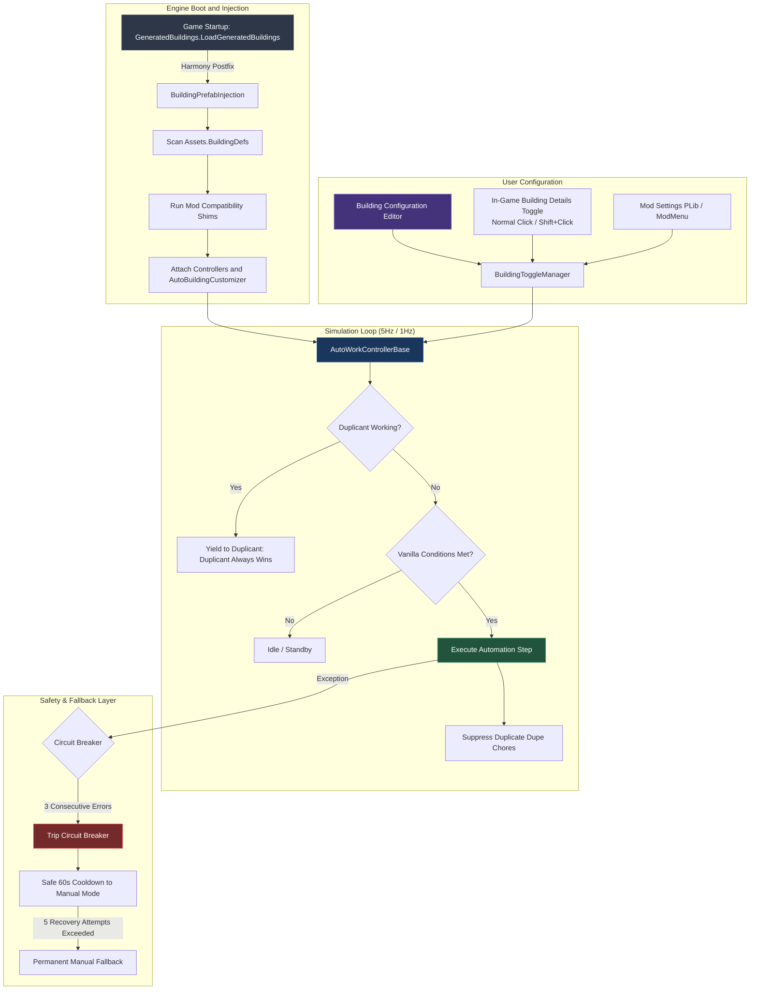
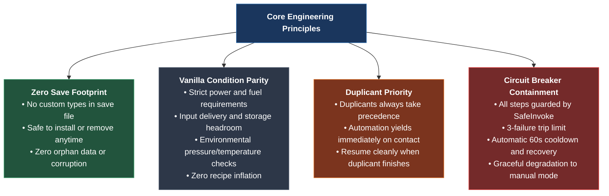

# Automatic Industry (Auto Machine Rebuilt) Wiki

Welcome to the **Automatic Industry** engineering wiki and architectural reference.

Automatic Industry is a comprehensive, high-performance automation overhaul for *Oxygen Not Included*. It enables industrial machinery, agricultural stations, ranching equipment, research facilities, and utility buildings to operate continuously and automatically when supply, power, and environmental conditions are met.

---

## 🧭 System Architecture at a Glance

---

## 📚 Wiki Sections & Navigation

| Section | Description | Key Topics |
| :--- | :--- | :--- |
| **[🎛️ Building Configuration & Controls](Building-Configuration-and-Controls)** | Interactive dual-pane configuration screen and in-game controls. | Dual-pane editor, search & category filters, Batch Toggle, Save button, Shift+Left Click quick toggle. |
| **[⚙️ Automated Buildings Logic](Automated-Buildings-Logic)** | Comprehensive logic reference for all 40+ automated buildings. | State machine hooks, power/fuel conditions, recipe progression, auto-drop, and chore suppression. |
| **[🏛️ Architecture & System Design](Architecture-and-Design)** | Deep dive into the component-driven engineering systems. | Prefab injection pipeline, 5Hz simulation cadence, zero-allocation chore filters, and circuit breakers. |
| **[🛡️ Multi-Mod Compatibility & Crash Guards](Multi-Mod-Compatibility-and-Crash-Guards)** | Defensive shims protecting against third-party mod conflicts. | Shims for *No Manual Delivery*, *ModMenu*, *Ronivan's Mods*, *Customize Buildings*, *FastTrack*, *SimDLL*. |
| **[📦 Compatible Mods Roster](Compatible-Mods)** | Tested, verified, and community-audited compatible mods. | Workshop links, compatibility status, tested versions, and multi-mod configuration notes. |
| **[📜 Incorporated Features](Incorporated-Features-from-Obsolete-Mods)** | Modernized and maintained features from legacy mods. | Auto-Sweeper crop harvesting, Liquid Reservoir direct fetching, and 100% save-safe ports. |

---

## 🎯 Core Engineering Principles

Automatic Industry is engineered with strict adherence to four non-negotiable principles:

| Principle | Technical Implementation | Benefit to Player |
| :--- | :--- | :--- |
| **Zero Save Footprint** | No custom serialized MonoBehaviours or entity classes. Prefab settings map to vanilla tags and colony registries. | Completely safe to enable, update, or uninstall mid-playthrough without corrupting saves. |
| **Vanilla Condition Parity** | Controllers strictly check `Operational.IsOperational`, `JoulesToGenerate`, storage headroom, and ambient pressure. | Preserves authentic game balance and power grids; no magical infinite resources. |
| **Duplicant Priority** | Real-time `worker != null` check yields control to Duplicants immediately whenever commanded. | Players can manually prioritize emergency tasks without disabling mod settings. |
| **Circuit Breakers (`SafeInvoke`)** | Evaluates steps within try-catch circuit breakers with auto-recovery cooldowns. | Transient mod errors or edge cases degrade to manual mode rather than crashing the game to desktop. |

---

## 🚀 What's New in v2.5.0

- **Dual-Pane Building Configuration Editor**:
  - Full-screen configuration interface with left-pane category filters (`All`, `Power`, `Food`, `Refinement`, `Stations`, `Utilities`) and real-time text search.
  - Active building counters (`Active: X / Total: Y`) per category.
  - **Batch Toggle Button**: Enable or disable all visible buildings with a single click.
  - **Dedicated Save Button & Immediate Auto-Save**: Guaranteed disk persistence across game sessions.
- **In-Game Building Details Automation Button**:
  - Direct toggle button on building inspection panels.
  - **Shift + Left Click**: Instantly flip automation on/off without waiting for a Duplicant wrench errand.
  - Rich bilingual tooltip explaining normal click vs Shift+Click behavior and mod attribution.
- **ModMenu Integration**:
  - Canvas sorting order set to 350, ensuring modal dialogs render cleanly above pause menus without UI clipping or occlusion.
  - Automatic dialog stack hiding and restoration when opening sub-screens.
- **Enhanced DLC & Base Game Filtering**:
  - Virtual Planetarium consolidated into a unified entry across DLCs.
  - Telescope dynamic sprite fallback correctly displays domed observatory icon in Spaced Out!

---

## 🔗 Community & Workshop Links

- **Steam Workshop**: [Automatic Industry (Steam ID: 3782701870)](https://steamcommunity.com/sharedfiles/filedetails/?id=3782701870)
- **Source Code Repository**: [GitHub (Eurekalo/Automatic_Industry)](https://github.com/Eurekalo/Automatic_Industry)
- **Issue Tracker**: [GitHub Issues](https://github.com/Eurekalo/Automatic_Industry/issues)
