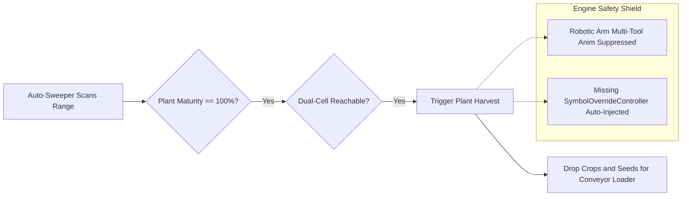
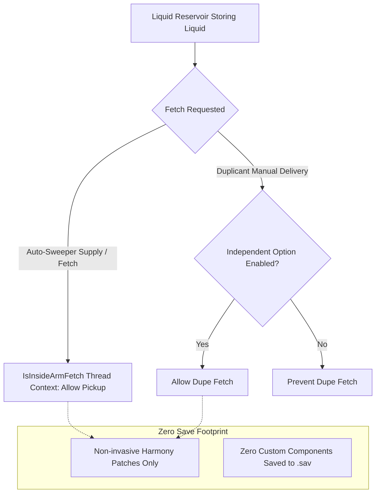

# Incorporated Features from Obsolete Mods

> [!NOTE]
> **Automatic Industry (Auto Machine Rebuilt)** fully or partially ports, modernizes, and maintains the working logic from the following legacy or obsolete community mods, ensuring they remain playable and bug-free on modern ONI versions.

- **Automatic Industry Workshop**: [Steam Workshop (ID: 3782701870)](https://steamcommunity.com/sharedfiles/filedetails/?id=3782701870)
- **Planned Compatibility List**: [Compatible Mods Roster](Compatible-Mods)
- **Architecture & System Design**: [Architecture & Design](Architecture-and-Design)

---

## 📦 Modernized Feature Implementations

### 1. Auto-Sweeper Harvest
- **Original Author**: *rafaelmarengoni*
- **Workshop Link**: [Steam Workshop (ID: 3566906492)](https://steamcommunity.com/sharedfiles/filedetails/?id=3566906492)
- **Original Feature**: Upgrades the Auto-Sweeper (`SolidTransferArm`) by enabling it to automatically harvest fully grown crops and wild plants within its operational range without requiring Duplicant labor.

- **Modernized Architecture in Automatic Industry**:
  - **Controller**: [`AutoSweeperHarvestController`](https://github.com/Eurekalo/Automatic_Industry/blob/main/AutomaticIndustry-src-2.4.0/AutomaticIndustry-src-2.4.0/src/Components/AutoSweeperHarvestController.cs)
  - **Enhancements**:
    - **Dual-Cell Reachability**: Verifies reachability for both the crop coordinate cell and the planter box / hydroponic tile foundation cell, preventing sweeping deadlocks.
    - **Universal Plant Compatibility**: Automatically detects maturity on all standard and DLC crops, arbor trees, wheezeworts, and modded agricultural plants.
    - **Dynamic Grid Integration**: Dynamically reads custom bounding zones from *Zoned Solid Transfer Arm* and *Adjustable Transfer Arm*.
    - **Engine Assertion Shield**: In `StandardWorkerAttachOverrideAnimsPatch`, suppresses duplicant multi-tool animation symbol bindings on robotic sweepers, eliminating the `Assert failed: Anim overrides containing additional symbols require a symbol override controller` crash.

---

### 2. Liquid Reservoir Boost 储液库增强
- **Workshop Link**: [Steam Workshop (ID: 2959805230)](https://steamcommunity.com/sharedfiles/filedetails/?id=2959805230)
- **Original Feature**: Allows players to manually order Duplicants to empty liquid reservoirs to obtain bottled liquids without deconstructing the building, and allows Duplicants to fetch bottled liquids directly from reservoirs when needed.

- **Modernized Architecture in Automatic Industry**:
  - **Patches**: [`LiquidReservoirFetchPatches`](https://github.com/Eurekalo/Automatic_Industry/blob/main/AutomaticIndustry-src-2.4.0/AutomaticIndustry-src-2.4.0/src/Patches/LiquidReservoirFetchPatches.cs) & [`AutoEmptyTriggerPatches`](https://github.com/Eurekalo/Automatic_Industry/blob/main/AutomaticIndustry-src-2.4.0/AutomaticIndustry-src-2.4.0/src/Patches/AutoEmptyTriggerPatches.cs)
  - **Enhancements**:
    - **Disambiguated Fetch Control**: Offers separate, independent options for **Duplicant Fetch** and **Auto-Sweeper Fetch**.
    - **Context Differentiation**: Utilizes `SolidTransferArm_FindFetchTarget_Patch.IsInsideArmFetch` thread-local context so robotic arms can freely supply reservoirs without triggering Duplicant delivery errand conflicts.
    - **Zero Save-Data Footprint**: Implemented purely via non-invasive Harmony patches without modifying `BuildingDef` or attaching fragile custom components, ensuring 100% save file safety.

---

## 🙏 Credits & Acknowledgments

Heartfelt thanks and full attribution to the original creators and modders who pioneered these automation ideas for the *Oxygen Not Included* community. Automatic Industry preserves and continues their legacy with active maintenance, DLC compatibility, and unified engine optimization.
