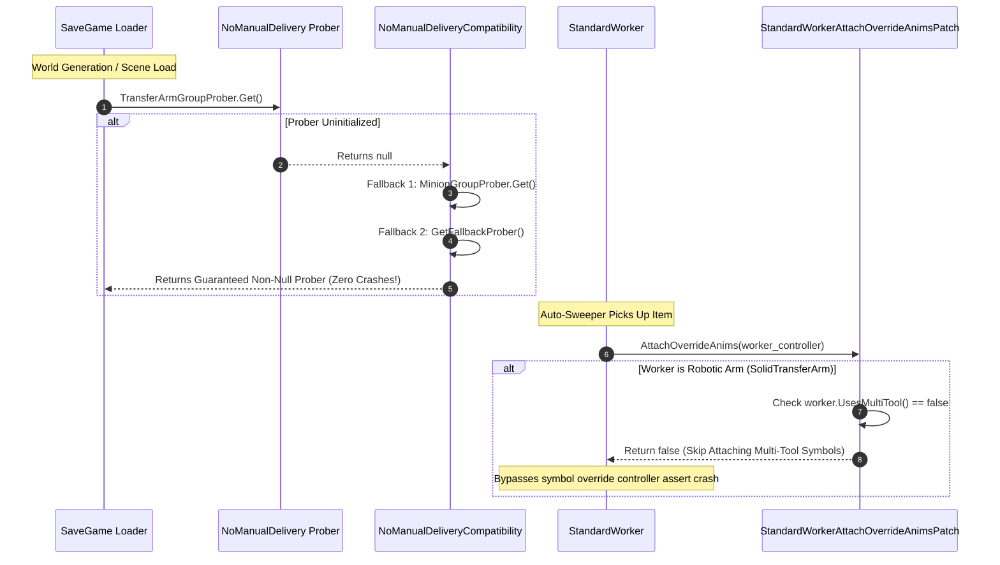
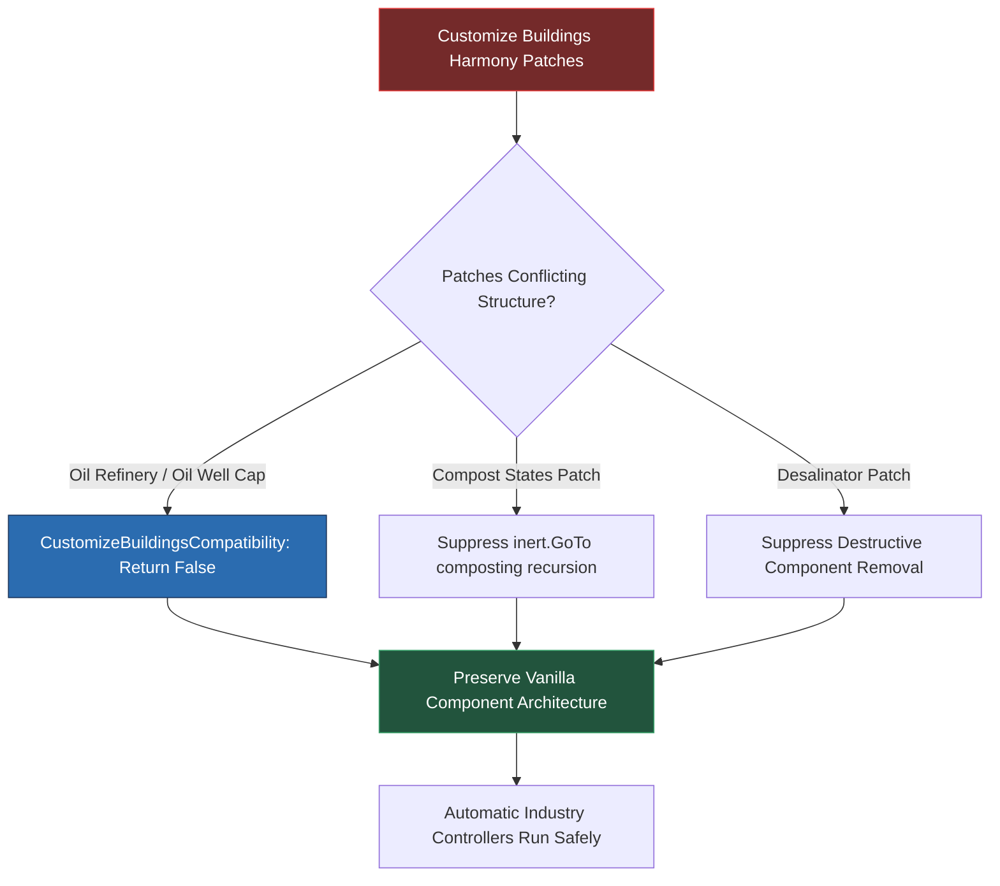
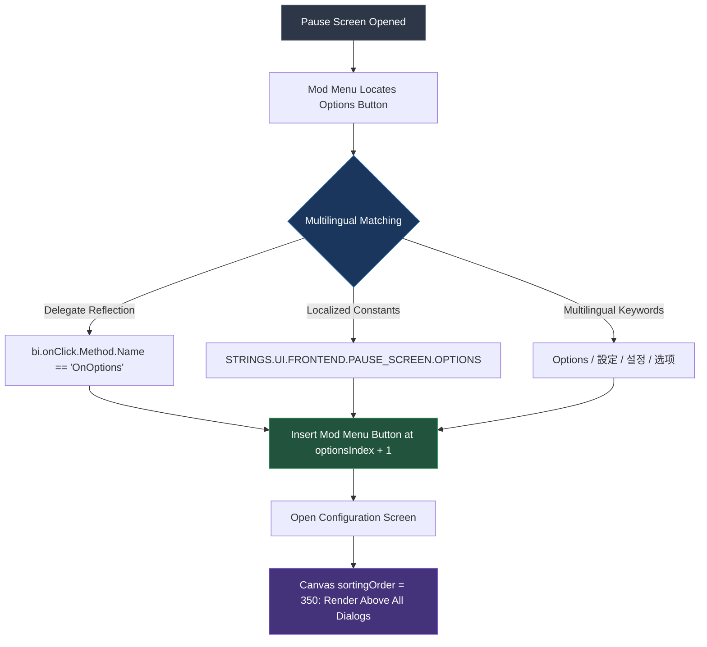
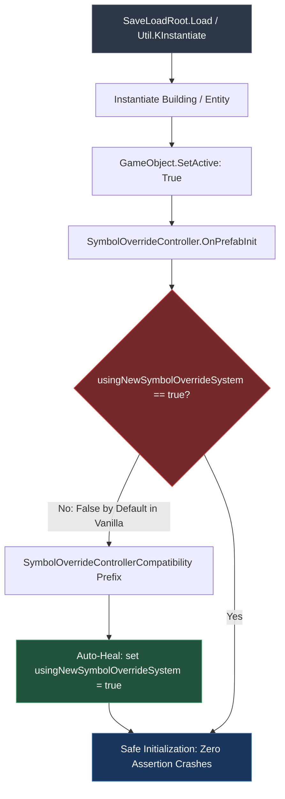
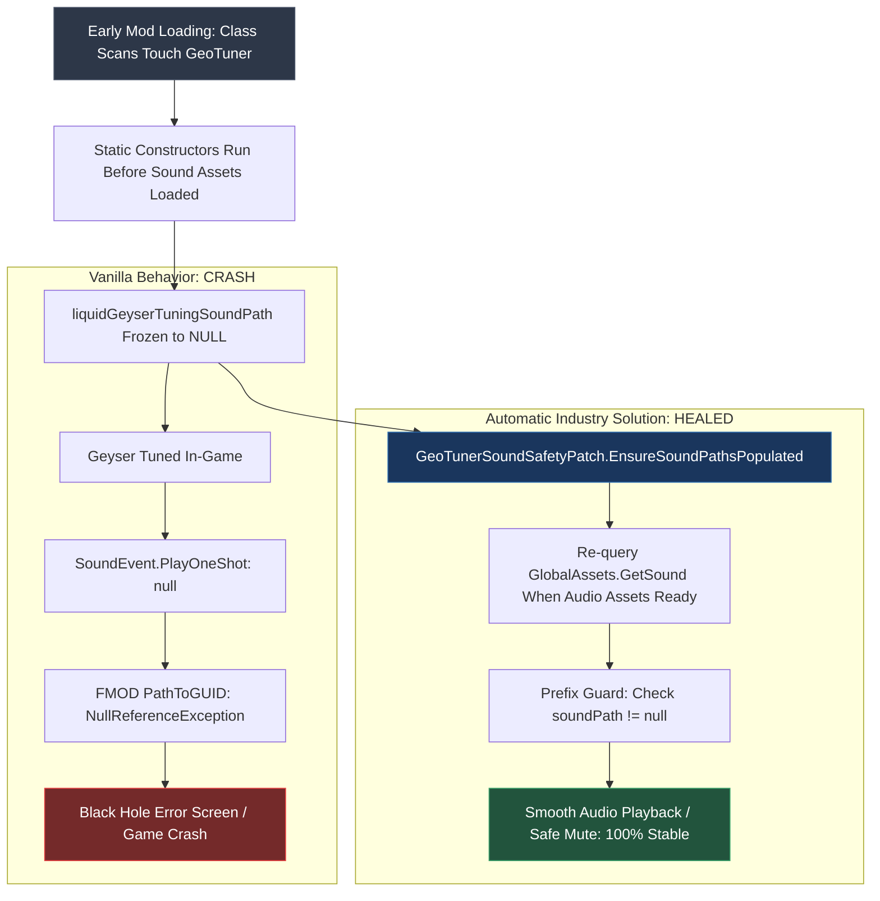

# Multi-Mod Ecosystem Compatibility & Crash Guard Systems

**Automatic Industry (Auto Machine Rebuilt)** is engineered to operate seamlessly within heavily modded *Oxygen Not Included* colonies (100+ active Workshop mods). 

This technical reference details the dedicated compatibility layers, runtime shims, defensive exception containments, and engine-level crash guards built into the mod.

---

## 🛡️ Compatibility Matrix at a Glance

| Mod | Steam ID | Challenge / Crash Risk | Automatic Industry Solution | Status |
| :--- | :---: | :--- | :--- | :---: |
| **No Manual Delivery** | `2047308624` | Null prober crash on load; robotic arm multi-tool anim assert. | Dual-tier fallback prober + `StandardWorkerAttachOverrideAnimsPatch`. | 🛡️ Active Shim |
| **PLib Mod Options** | — | Layout collapse; method signature differences (`dialog` vs `optionsDialog`). | `OptionsDialogLayoutFixPatch` enforces 1020x720 layout via defensive reflection. | 🛡️ Active Shim |
| **Customize Buildings** | `1818138009` | Strips vanilla components; infinite composting state recursion. | Dynamic prefix shims return `false` on conflicting patches; `[MyCmpGet]` safety. | 🛡️ Active Shim |
| **I_实用系统** | `3300147615` | Potential logic port collisions and state synchronization errors. | Clean `GameHashes.OperationalChanged` hooks; zero custom port overrides. | 🟢 Coexistence |
| **Multithreaded Sim** | `3779276157` | Race conditions against Rust native worker threads. | Automation loops execute strictly on Unity main thread (`ISim200ms`, `ISim1000ms`). | 🟢 Thread-Safe |
| **EmptyStorage** | `1748202748` | Dropped items re-picked in infinite loops; entity ID loss. | `VanillaEmptyPaths` exempts player-ejected items from auto-recycling. | 🛡️ Active Shim |
| **Adjustable / Zoned Arm** | `3745253371` | Hardcoded 4-cell range limits sweep and crop harvesting. | `AutoSweeperHarvestController` dynamically queries custom cell zones. | 🟢 Integrated |
| **Mod Menu (v1.4.13)** | `3789353358` | UI occlusion; button position misalignment across languages. | Multilingual Options locator + canvas `sortingOrder = 350` layering. | 🎨 Full UI Sync |
| **FastTrack** | — | High-frequency reflective overhead causing framerate dips. | Full component caching in `Prepare()`; zero reflection in 5Hz tick loops. | ⚡ Optimized |
| **ONI Together** | — | State desynchronization across multiplayer clients. | State changes broadcast via standard game events and sync packets. | 🟢 Synced |
| **Ronivan's Legacy Suite** | `3557584850` | Missing UI canvas on `BuildingEditor`; `usingNewSymbolOverrideSystem` assert. | Safe UI parenting resolver + `SymbolOverrideController` auto-healing. | 🛡️ Active Shim |
| **GeoTuner Audio Safety** | — | Early mod reflection touches `GeoTuner`, freezing sound paths to `null`. | Dynamic sound path auto-healing + prefix null-path muting. | 🛡️ Active Shim |

---

## 1. No Manual Delivery (Steam ID 2047308624)

### Engineering Solutions:
1. **Dual-Tiered Fallback Prober**:
   - `NoManualDeliveryCompatibility.cs` intercepts `TransferArmGroupProber.Get()`. If `null`, it substitutes `MinionGroupProber.Get()` or an internal fallback prober, completely eliminating `NullReferenceException` during early scene loading.
2. **Robotic Multi-Tool Animation Guard**:
   - `StandardWorkerAttachOverrideAnimsPatch` checks `worker.UsesMultiTool()`. If false or if the worker lacks `SymbolOverrideController`, it aborts attaching Duplicant tool animations, eliminating the engine assertion crash.
3. **Proactive Symbol Controller Injection**:
   - `BuildingPrefabInjection` automatically attaches a `SymbolOverrideController` to `SolidTransferArm` prefabs on spawn for defense-in-depth.

---

## 2. PLib UI Layout & Options Dialog Resilience

### Challenge:
Bilingual descriptions and long localization strings can push options controls outside the visible dialog window. Upstream PLib parameter signatures also vary between `PDialog dialog` and `OptionsDialog optionsDialog`.

### Engineering Solution:
- **`OptionsDialogLayoutFixPatch.cs`**:
  - Dynamically enforces minimum dialog dimensions (1020x720) with horizontal two-column layout.
  - Postfix parameters bind cleanly to `object dialog`.
  - Registered via `SafeInvoke.Try` in `AutoMachineMod.OnLoad()` so future PLib updates load cleanly without crashing.

---

## 3. Customize Buildings (Steam ID 1818138009)

### Engineering Solution:
- Applies runtime Harmony prefix shims that return `false` to cancel destructive modifications.
- Suppresses `Compost_States_Patch.Postfix` to prevent infinite composting loops.
- Upgrades component accessors from `[MyCmpReq]` to `[MyCmpGet]` with defensive null checks throughout simulation loops.

---

## 4. Mod Menu (v1.4.13) & In-Game Screen Integration

### Engineering Solutions:
1. **Multilingual Options Button Locator**:
   - Locates the pause screen's "Options" button via delegate reflection and multilingual strings.
   - Places the "Mod Menu" button directly below "Options", never appending it below "Quit to Desktop".
2. **Canvas Sorting Order (`sortingOrder = 350`)**:
   - Ensures child configuration dialogs render above both the Pause Menu and ModMenu windows without raycast blocking or visual clipping.

---

## 5. Chemical Processing & BuildingEditor Safe UI Parenting

### Challenge:
Ronivan's *Chemical Processing* includes a `BuildingEditor` tool that calls `ShowWindow()`. In active gameplay or pause states, `FrontEndManager.Instance` can be `null`, crashing the game when attempting to attach to the front-end canvas.

### Engineering Solution:
- **`ChemicalProcessingCompatibility.cs`**:
  - Dynamically intercepts `BuildingEditor.ShowWindow()` with a safe UI parenting resolver.
  - Automatically redirects parenting to `GameScreenManager.Instance.ssOverlayCanvas` or `GetTargetWidget()` when `FrontEndManager.Instance` is unavailable.

---

## 6. SymbolOverrideController Deserialization Auto-Healing

### Engineering Solution:
- Pre-emptively inspects the associated `KBatchedAnimController`. If `usingNewSymbolOverrideSystem` is `false`, auto-heals it to `true` before vanilla's assert evaluates, ensuring 100% crash-free save loading for Ronivan's industrial suite.

---

## 7. GeoTuner Audio Path Auto-Healing (Black Hole Fix)

### Engineering Solution:
- **`GeoTunerSoundSafetyPatch.cs`**:
  - **Auto-Healing**: Re-resolves static sound paths against `GlobalAssets.GetSound()` once audio banks load.
  - **Defensive Harmony Prefix**: Verifies `!string.IsNullOrEmpty(soundPath)` prior to triggering playback, safely muting if audio is unavailable.
